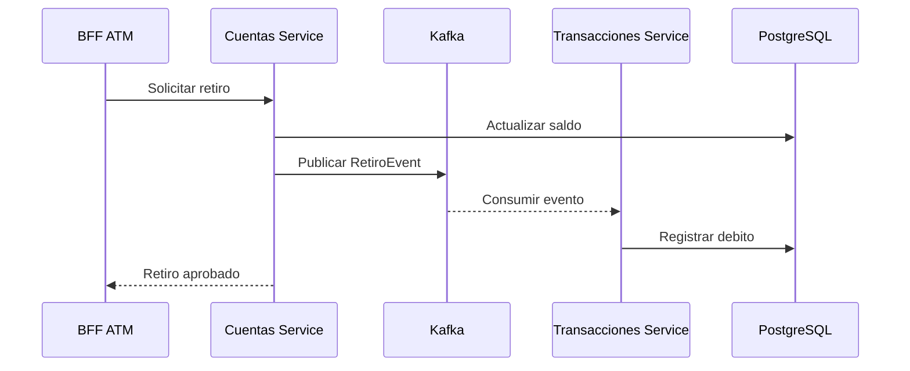

# Banco XYZ Cloud

## Evaluacion sumativa Semana 8

**Asignatura:** Desarrollo Backend III  
**Estudiante:** Angelo Silva  
**Experiencia:** 3  
**Semana:** 8

## Descripcion

Este proyecto corresponde a la evolucion del sistema bancario trabajado durante las semanas anteriores. La solucion conserva los microservicios de cuentas y transacciones y los tres BFF para Web, Mobile y ATM, pero ahora incorpora componentes de Spring Cloud, seguridad OAuth2, tolerancia a fallos, mensajeria asincrona y contenedores Docker.

El acceso externo se realiza por medio de un API Gateway protegido con tokens JWT emitidos por Keycloak. Los servicios se registran en Eureka, consumen configuraciones desde Config Server y utilizan Resilience4j para responder de manera controlada cuando otro servicio deja de estar disponible. Los retiros se publican como eventos Kafka y son procesados por el servicio de transacciones.


## Tecnologias utilizadas

- Java 17.
- Spring Boot 3.5.0.
- Spring Cloud 2025.0.0.
- Spring Cloud Config.
- Netflix Eureka.
- Spring Cloud Gateway.
- Spring Security OAuth2 Resource Server.
- Keycloak.
- Resilience4j.
- Apache Kafka.
- PostgreSQL 16.
- Docker y Docker Compose.
- Maven.

## Requisitos

- Docker Desktop iniciado.
- Al menos 8 GB de memoria disponible para Docker.
- Puertos 8080, 8180, 8761, 8888 y 5433 disponibles.

No es necesario instalar PostgreSQL, Kafka ni Keycloak de forma separada porque Docker Compose prepara todos los componentes.

## Seguridad OAuth2

Keycloak importa automaticamente el realm `banco-xyz`. Las credenciales incluidas son solamente para pruebas locales:

| Dato | Valor |
|---|---|
| Realm | `banco-xyz` |
| Client ID | `banco-api` |
| Usuario | `angelo` |
| Clave | `angelo123` |
| Administrador Keycloak | `admin` / `admin` |

Solicitud manual de token:

```powershell
$tokenResponse = Invoke-RestMethod `
  -Method Post `
  -Uri "http://localhost:8180/realms/banco-xyz/protocol/openid-connect/token" `
  -ContentType "application/x-www-form-urlencoded" `
  -Body @{
    grant_type = "password"
    client_id  = "banco-api"
    username   = "angelo"
    password   = "angelo123"
  }

$headers = @{ Authorization = "Bearer $($tokenResponse.access_token)" }
```

Sin el token, el Gateway responde `HTTP 401 Unauthorized`. Con el token se puede consultar el BFF Web:

```powershell
Invoke-RestMethod `
  -Uri "http://localhost:8080/api/web/cuentas/101" `
  -Headers $headers
```

El canal ATM mantiene una segunda proteccion mediante la cabecera `X-ATM-KEY`:

```powershell
$headersAtm = @{
  Authorization = "Bearer $($tokenResponse.access_token)"
  "X-ATM-KEY"  = "BANCO-XYZ-ATM-2026"
}

Invoke-RestMethod `
  -Uri "http://localhost:8080/api/atm/cuentas/101/saldo" `
  -Headers $headersAtm
```

## Evento asincrono de retiro

Cuando se realiza un retiro, `cuentas-service` actualiza el saldo y publica un evento en el topico `banco.retiros`. `transacciones-service` consume el evento y registra el debito en PostgreSQL.

Cada evento incluye un identificador unico. La tabla `eventos_procesados` evita registrar dos veces el mismo mensaje si Kafka vuelve a entregarlo.




## Estructura principal

```text
Exp3_S8_Angelo_Silva
|-- api-gateway
|-- config-server
|-- discovery-server
|-- cuentas-service
|-- transacciones-service
|-- bff-web
|-- bff-mobile
|-- bff-atm
|-- config-repo
|-- database
|-- security
|-- scripts
|-- documentacion
|-- evidencias
|-- Dockerfile
|-- compose.yaml
`-- pom.xml
```

